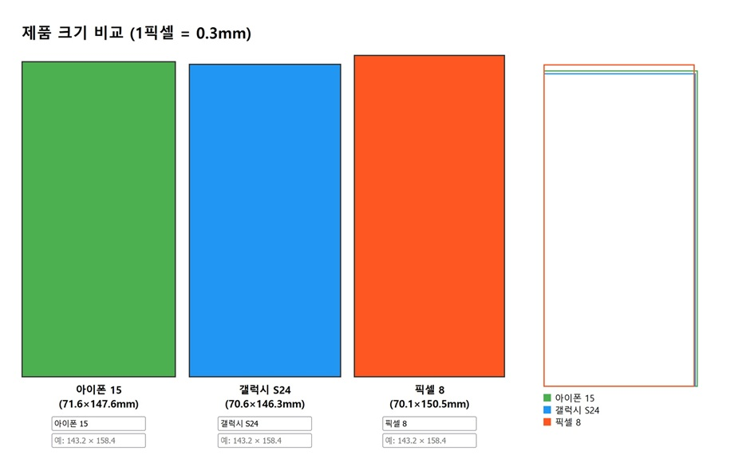

# 제품 크기 비교 웹페이지

### 즉시! 사용
[https://dodookmung.github.io/product-size/](https://dodookmung.github.io/product-size/)

**사용 방법**:
1. `index.html`을 브라우저에서 열기
2. 필요 시 이름 및 크기 입력창에서 값 변경
3. 변경사항은 실시간 반영됨

이 웹페이지는 다양한 제품(예: 스마트폰)의 크기를 시각적으로 비교할 수 있는 도구입니다.  
**기능:**
- 제품별 크기를 **픽셀 단위로 변환**하여 화면에 표시 (1픽셀 = 0.3mm)
- **개별 보기**: 각 제품을 별도 박스로 표시
- **겹침 보기**: 여러 제품을 한 화면에 겹쳐 비교
- **이름 및 크기 수정 가능**: 입력창을 통해 제품명과 크기(mm) 변경
- **범례 표시**: 제품별 색상과 이름 확인

**기본 데이터 예시**:
- 아이폰 15: 71.6 × 147.6 mm
- 갤럭시 S24: 70.6 × 146.3 mm
- 픽셀 8: 70.1 × 150.5 mm

